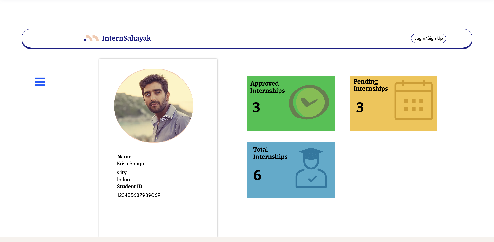
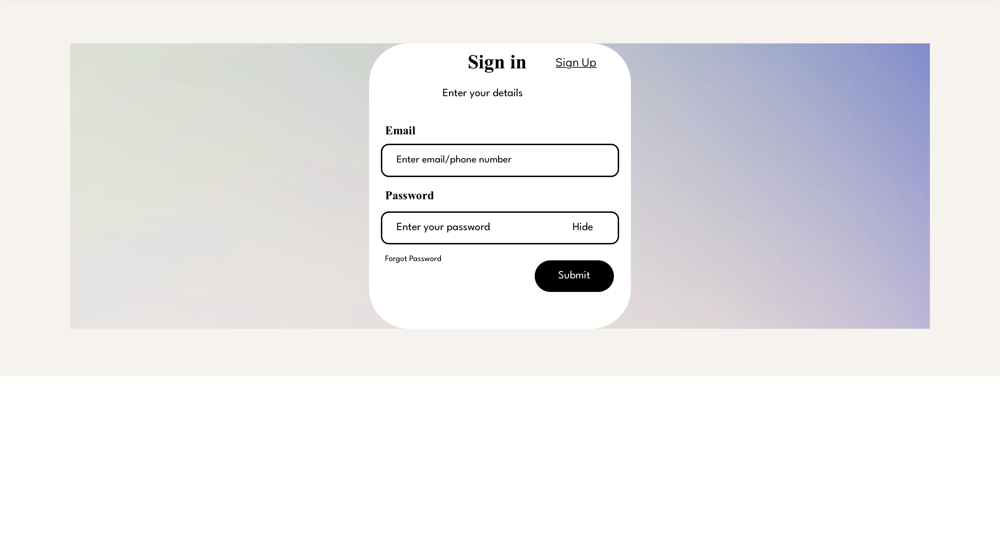
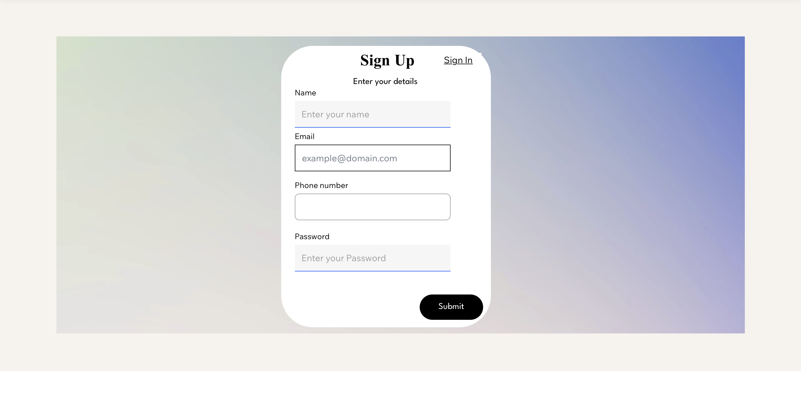
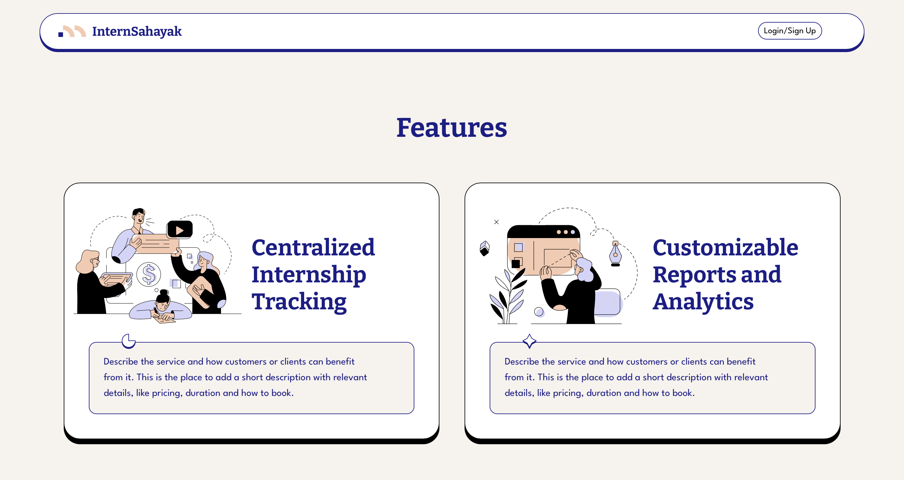
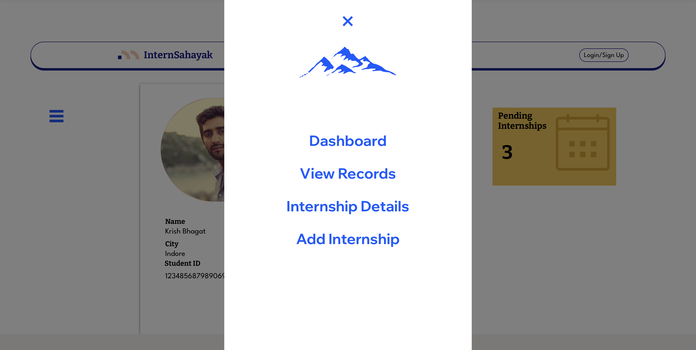
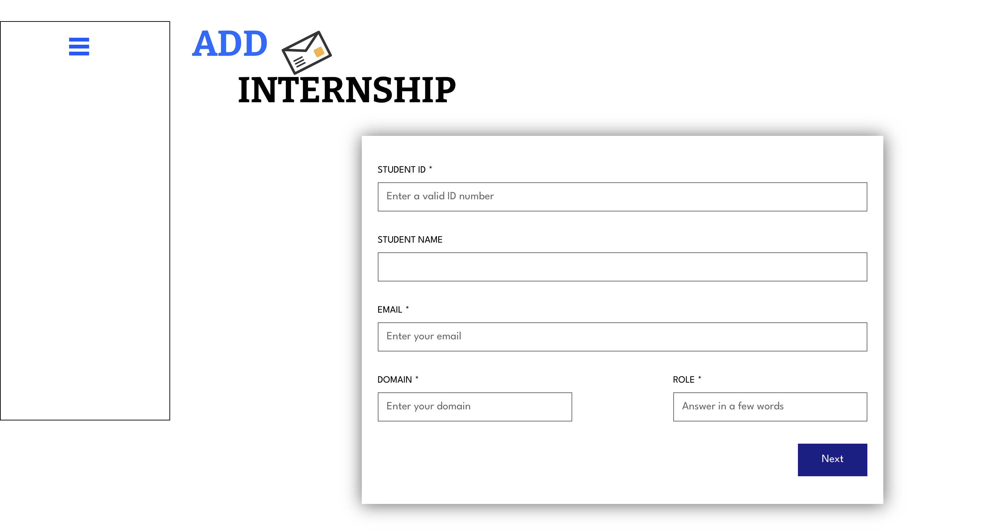
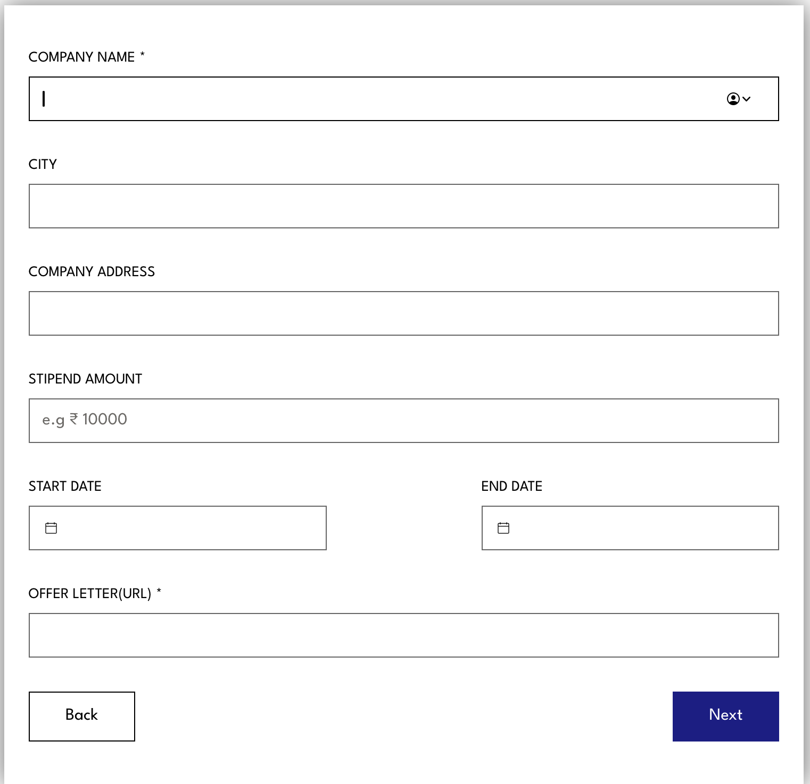
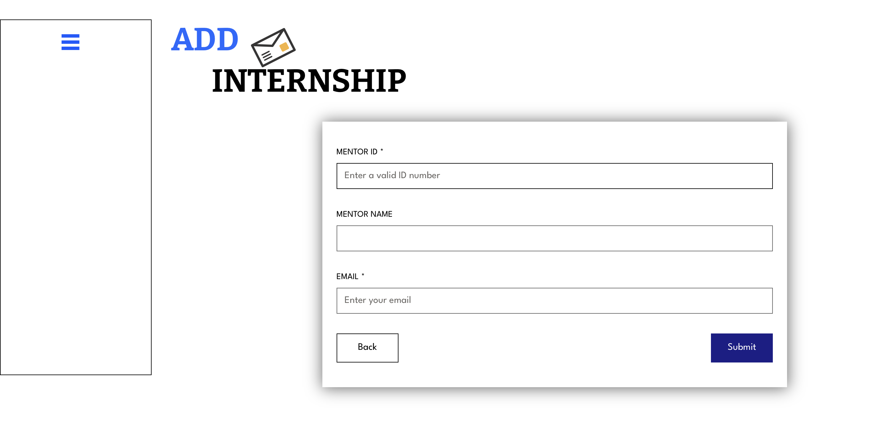
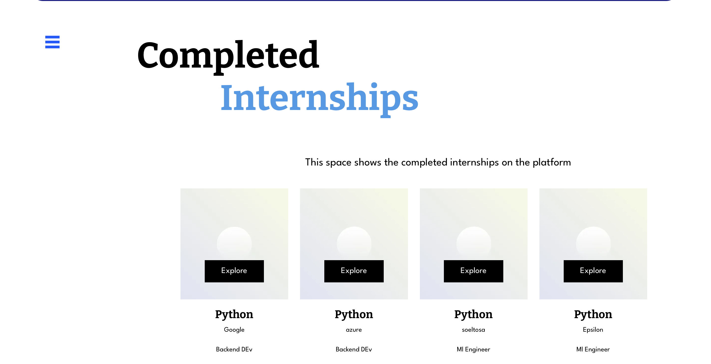

# intership-management-sashakt
# Project Intern Management System using PHP/MySQL

## About This Project

The Intern Management System using PHP and MySQL can help a particular company manage the progress of their interns. The system has four system users: the Admin,Personel,Lecturer and the Intern.

Admin users can have a full control over the system. They have access to the whole list of interns. They will create a new user/intern, assign programs and tasks as well as their due dates and status. Admin users can also add, edit, or delete this information. Moreover, they can also modify the program list or status list. Intern users can only have access to their own data. They can edit their tasks' status, and personal information. Both Admin and Intern can use the filter and sort functions.

This application can also be used for similar purposes such as managing projects, students, etc.

## Features of Intern Management System

- Login Page
- Dashboard
- Admin Settings
- Add internship
- veiw internship
  and Many More..

## Tools

- Name of Project: Intern Management System Project
- Language: PHP
- Databases used: MySQL
- Design used: HTML, CSS, JavaScript, JQuery, Bootstrap
- Software used: XAMPP

## Screenshots

_Login Page_

